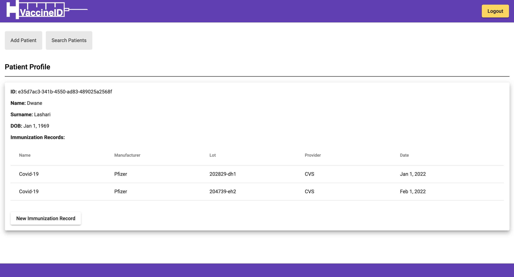

# Vaccine credentials for all! An example of a cloud-native microservice built with Angular, Azure, Docker, "Distroless" Container Images, Flask, Gunicorn, Kubernetes, Nginx, OpenAPI, and Python.

 1. [Overview](#overview)
 2. [Contents](#contents)
 3. [Prerequisites](#prerequisites)
 4. [Setup](#setup)
 5. [Deploy](#deploy)
 6. [Test](#test)

## Overview

VaccineID is a demonstration of Microsoft Identity platform, using Azure Active Directory (AAD) for authentication and authorization, AAD workload identity federation with Kuberentes, Cosmos DB role based access using AAD, and Microsoft Authentication Library (MSAL) for Angular and Python.




## Contents

The following files contain configuration parameters required to deploy VaccineID in your environment.

| File/folder                         | Description                                  |
|-------------------------------------|----------------------------------------------|
| `nginx/spa/src/app/auth-config.ts`  | AAD parameters for Angular SPA client.       |
| `k8s/vaccine-id.yaml`               | AAD parameters for Kubernetes app.           |

## Prerequisites

- An active **Azure** subscription with **Azure Active Directory**, **Azure Cosmos DB**, and **Azure CLI**. See [How to get an Azure Active Directory tenant](https://docs.microsoft.com/azure/active-directory/develop/quickstart-create-new-tenant) for details.
- **Docker** for building images. See [Docker](https://www.docker.com/) for details.
- **Kubernetes** cluster with **AAD Workload Identity** federation. See [Kubernetes](https://kubernetes.io/) and [Workload Identity](https://azure.github.io/azure-workload-identity/docs/introduction.html) for details.

## Setup

### Step 1. Create a Cosmos DB Container

1. Navigate to the [Azure portal](https://portal.azure.com) and select **Azure Cosmos DB** service.
2. Create a new Azure Cosmos account, or select an existing account for Core (SQL).
3. Open the **Data Explorer** pane, and select **New Container**. Next, provide the following details:
   - Use `vaccine-id` as the Databse id.
   - Use `patients` as the Container id.
   - Use `id` as the Partition key value.
4. Select **OK** to create the Container.

### Step 2. Register AAD application for the K8s app (vaccine-id)

1. Navigate to the [Azure portal](https://portal.azure.com) and select **Azure Active Directory** service.
2. Select **App registrations**.
3. Select **New registration**.
4. In the **Register an application page** that appears, enter your application's registration information:
   - In the **Name** section, enter a meaningful application name that will be displayed to users of the app, for example `vaccine-id`.
   - Under **Supported account types**, select **Accounts in this organizational directory only**.
5. Select **Register** to create the application.
6. In the app's registration screen, find and note the **Application (client) ID**. You use this value in your app's configuration file(s) later.
7. Select **Save** to save your changes.
8. Establish federated identity credential between the AAD application and the service account issuer & subject
```console
   cat <<EOF > body.json
   {
   "name": "kubernetes-federated-credential",
   "issuer": "${SERVICE_ACCOUNT_ISSUER}",
   "subject": "system:serviceaccount:${SERVICE_ACCOUNT_NAMESPACE}:${SERVICE_ACCOUNT_NAME}",
   "description": "Kubernetes service account federated credential",
   "audiences": [
      "api://AzureADTokenExchange"
   ]
   }
   EOF

   az rest --method POST --uri "https://graph.microsoft.com/beta/applications/${APPLICATION_OBJECT_ID}/federatedIdentityCredentials" --body @body.json
```

### Step 3. Setup Cosmos DB Role based access control

1. Create a custome role defination or use a bult-in role. See [How to Setup RBAC](https://docs.microsoft.com/en-us/azure/cosmos-db/how-to-setup-rbac).
2. Assign role defination to K8s client app, created in step 2.
```console
   resourceGroupName='<myResourceGroup>'
   accountName='<myCosmosAccount>'
   readOnlyRoleDefinitionId = '<roleDefinitionId>' # as fetched above
   principalId = '<aadPrincipalId>'
   az cosmosdb sql role assignment create --account-name $accountName --resource-group $resourceGroupName --scope "/" --principal-id $principalId --role-definition-id $readOnlyRoleDefinitionId
```

### Step 4. Register AAD application for the API (vaccine-id-api)

1. Navigate to the [Azure portal](https://portal.azure.com) and select **Azure Active Directory** service.
2. Select **App registrations**.
3. Select **New registration**.
3. In the **Register an application page** that appears, enter your application's registration information:
   - In the **Name** section, enter a meaningful application name that will be displayed to users of the app, for example `vaccine-id-api`.
   - Under **Supported account types**, select **Accounts in this organizational directory only**.
4. Select **Register** to create the application.
5. In the app's registration screen, find and note the **Application (client) ID**. You use this value in your app's configuration file(s) later.
6. Select **Save** to save your changes.
7. In the app's registration screen, click on the **Expose an API**  to the left to open the page where you can declare the parameters to expose this app as an API for which client applications can obtain [access tokens](https://docs.microsoft.com/azure/active-directory/develop/access-tokens) for.
The first thing that we need to do is to declare the unique [resource](https://docs.microsoft.com/azure/active-directory/develop/v2-oauth2-auth-code-flow) URI that the clients will be using to obtain access tokens for this API. To declare an resource URI, follow the following steps:
   - Click `Set` next to the **Application ID URI** to generate a URI that is unique for this app.
   - For this sample, accept the proposed Application ID URI (api://{clientId}) by selecting **Save**.
8. All APIs have to publish a minimum of one [scope](https://docs.microsoft.com/azure/active-directory/develop/v2-oauth2-auth-code-flow#request-an-authorization-code) for the client's to obtain an access token successfully. To publish a scope, follow the following steps:
   - Select **Add a scope** button to open the **Add a scope** screen and enter the values as indicated below:
      - For **Scope name**, use `Patients.Admin`.
      - Select **Admins and users** options for **Who can consent?**
      - For **Admin consent display name** type `Access vaccine-id-api`
      - For **Admin consent description** type `Allows the app to access vaccine-id-api as the signed-in user.`
      - For **User consent display name** type `Access vaccine-id-api`
      - For **User consent description** type `Allow the application to access vaccine-id-api on your behalf.`
      - Keep **State** as **Enabled**
      - Click on the **Add scope** button on the bottom to save this scope.
9. On the left side menu, select the **Manifest**.
   - Set `accessTokenAcceptedVersion` property to `2`
10. Click on **Save**.

### Step 4. Register AAD application for the Angular client app (vaccine-id-spa)

1. Navigate to the [Azure portal](https://portal.azure.com) and select the **Azure Active Directory** service.
2. Select **App registrations**.
3. Select **New registration**.
3. In the **Register an application page** that appears, enter your application's registration information:
   - In the **Name** section, enter a meaningful application name that will be displayed to users of the app, for example `vaccine-id-spa`.
   - Under **Supported account types**, select **Accounts in this organizational directory only**.
   - In the **Redirect URI (optional)** section, select **Single-page application** in the combo-box and enter your apps URI, for example: `https://vaccine-id.example.com:8443/`.
4. Select **Register** to create the application.
5. In the app's registration screen, find and note the **Application (client) ID**. You use this value in your app's configuration file(s) later in your code.
6. In the app's registration screen, click on the **API permissions** in the left to open the page where we add access to the APIs that your application needs.
   - Click the **Add a permission** button and then,
   - Ensure that the **My APIs** tab is selected.
   - In the list of APIs, select the API `vaccine-id-api`.
   - In the **Delegated permissions** section, select the **Patients.Admin** in the list. Use the search box if necessary.
   - Click on the **Add permissions** button at the bottom.

## Deploy 

### Step 1. Clone or download this repository

```console
    git clone https://github.com/fbalouch/vaccineID.git
```

or download and extract the repository .zip file.

### Step 2. Update Angular SPA client configuration (auth-config.ts), replace following with your details.
```console
   aad_tenant_id
   vaccine_id_api_scope
   vaccine_id_spa_aad_application_client_id
```

### Step 3. Build NGINX image

```console
    cd nginx
    docker build -t vaccine-id-nginx:v1.0 .
```

### Step 4. Build API image

```console
    cd api
    docker build -t vaccine-id-api:v1.0 .
```

### Step 5. Tag and push images to your image repository, should accessible by Kubernetes nodes.

### Step 6. Update Kubernetes manifest (vaccine-id.yaml), replace following with your details.
```console
   aad_tenant_id
   cosmos_db_name
   cosmos_db_url
   vaccine_id_aad_application_client_id
   vaccine_id_api_aad_application_client_id
```

### Step 7. Deploy to Kubernetes

```console
    cd k8s
    kubectl apply -f vaccine-id.yaml
```

## Test

### Step 1. Create test user with access to app
1. Navigate to the [Azure portal](https://portal.azure.com) and select **Azure Active Directory** service.
1. Select **Users**.
2. Select **New user** and then either **Create new user** or **Invite external user**.
3. Once user is created, navigate to back **Azure Active Directory** service.
4. Select **Enterprise applications** then find and select your AAD application (vaccine-id-api).
5. Select **Properties** on left and then set **Assignment required?** to `Yes`. This will require users be assigned the app to get access.
6. Select **Users and groups** then **Add user/group**.
7. Select and add your new or invited user.

### Step 2. Login to VaccineID as user and test